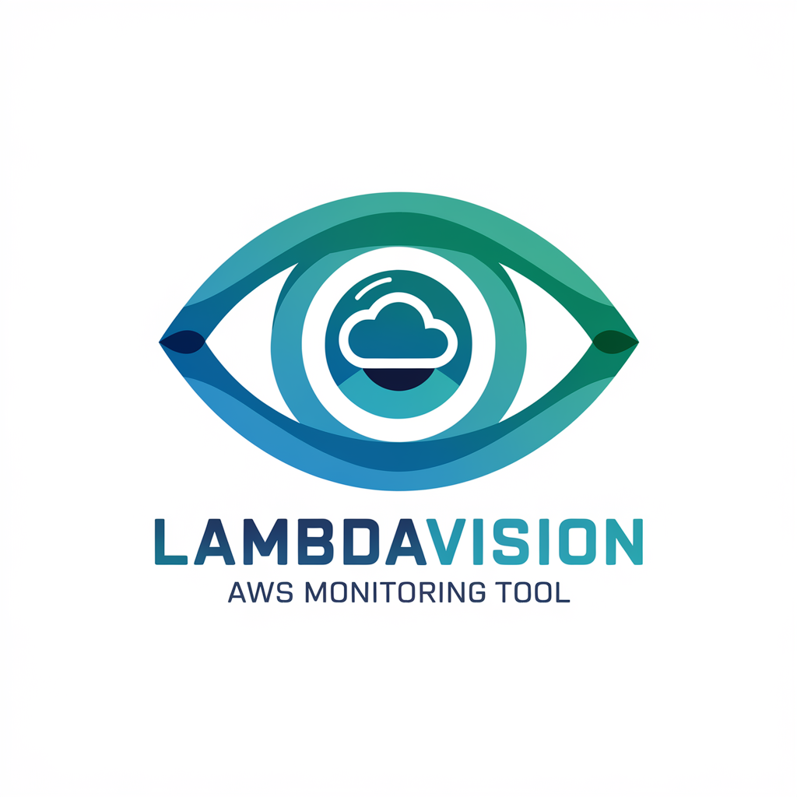

# LambdaVision - AWS Lambda Observability Platform

LambdaVision is an open-source software project designed to provide clear, actionable insights into AWS Lambda functions. It simplifies the observability of serverless applications by offering a streamlined platform that focuses on real-time monitoring and performance tracking.

LambdaVision enables software engineers to gain deep visibility into Lambda function executions, making it easier to track invocation details, identify performance bottlenecks, and debug errors. By integrating with AWS CloudWatch, LambdaVision enhances the monitoring experience, offering actionable insights to optimize Lambda-based workloads and ensure smooth, efficient serverless applications.


## Tech Stack 
[](https://skillicons.dev)  


## Table of Contents 
- [Introduction](#introduction) 
- [Features](#features)
- [Installation](#installation) 
- [User Guide](#UserGuide) 
- [Contributing](#ContributionInstructions)
- [License](#license)
- [Lambda Vision Team](#LambdaVisionTeam)
- [Contact](#Contact)

## Features

- **Real-time monitoring**: Track the performance of Lambda functions in real time, including invocation metrics, duration, and success rates.
- **Deep visibility**: Gain insights into each Lambda invocation, including input and output data, errors, and execution details.
- **Error tracking**: Identify and analyze errors in Lambda functions with detailed logs and stack traces.
- **Performance optimization**: Track function performance, pinpoint bottlenecks, and improve the efficiency of serverless applications.
- **CloudWatch integration**: Leverage AWS CloudWatch metrics for an enhanced monitoring experience.
- **Developer-focused interface**: A simplified, user-friendly interface for developers to easily understand and act on observability data.

## Installation

To get started with LambdaVision, follow the instructions below to set up the project:

### Prerequisites

- AWS Account
- AWS CLI configured

### Setup Instructions

1. Clone the repository:
   ```bash
   git clone https://github.com/yourusername/LambdaVision.git
   cd LambdaVision
_______________

Install dependencies:
bash
Copy
npm install

Configure AWS credentials: Make sure your AWS credentials are set up using AWS CLI or environment variables.
bash
Copy
aws configure

Deploy Lambda functions (Optional, if using Serverless Framework): If you are using Serverless, deploy the functions with:
bash
Copy
serverless deploy

## UserGuide

## Contribution Instructions 

We welcome contributions to **LambdaVision**! If you'd like to contribute, please follow these guidelines:  

### How to Contribute  
1. **Fork the Repository** – Click the "Fork" button on the GitHub repository to create a copy in your account.  

2. **Clone the Repository** – Clone your forked repository to your local machine:  
   ```bash
   git clone https://github.com/yourusername/LambdaVision.git
   cd LambdaVision
   ```
3. **Create a Branch** – Create a new branch for your feature or fix:  
   ```bash
   git checkout -b feature-name
   ```
4. **Make Changes** – Implement your changes and commit them with clear, descriptive messages:  
   ```bash
   git commit -m "Add feature: description of changes"
   ```
5. **Push to GitHub** – Push your changes to your forked repository:  
   ```bash
   git push origin feature-name
   ```
6. **Submit a Pull Request** – Open a pull request (PR) to the main repository, describing your changes.  

### Contribution Guidelines  
- Follow the existing **coding style** and project structure.  
- Write **clear commit messages** and keep your changes concise.  
- Ensure your changes are **well-tested** before submitting.  
- If you’re adding a feature, update the **documentation** accordingly.  
- Be respectful and open to feedback during code reviews.  

### Reporting Issues  
If you encounter any bugs or have feature requests, please [open an issue](https://github.com/yourusername/LambdaVision/issues) and provide as much detail as possible.  

## License

## Lambda Vision Team
- Daisha Davis [Github](https://github.com/daishadavis) | [Linkedin]()
- Tiara Dillard [Github](http://github.com/yosoytiara/) | [Linkedin]()
- Darren Estrada [Github](https://github.com/darrenestrada) | [Linkedin]()
- Jocelyn R [Github](https://github.com/1JocelynR) | [Linkedin]()
- Gaetan Fleurentin [Github](https://github.com/Gfleurentin) | [Linkedin]()


## Contact
<a href="https://www.linkedin.com/company/lambdavision/" target="blank">
 </a
 
<p align="right">(<a href="#readme-top">back to top</a>)</p>